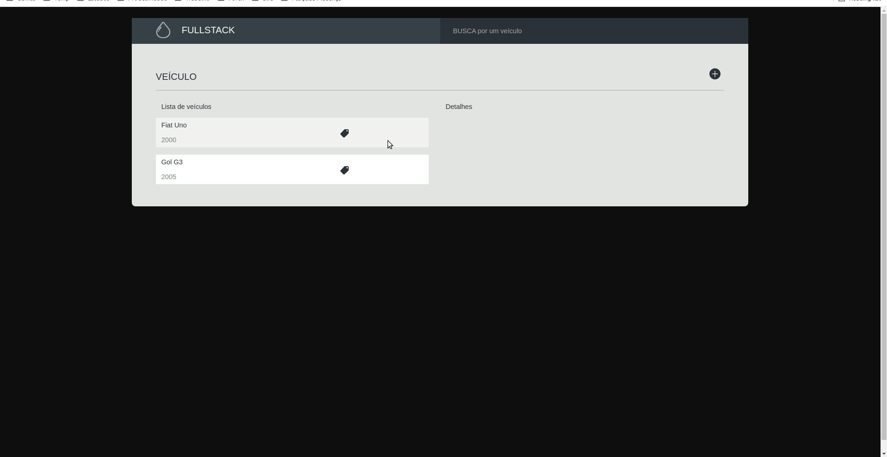
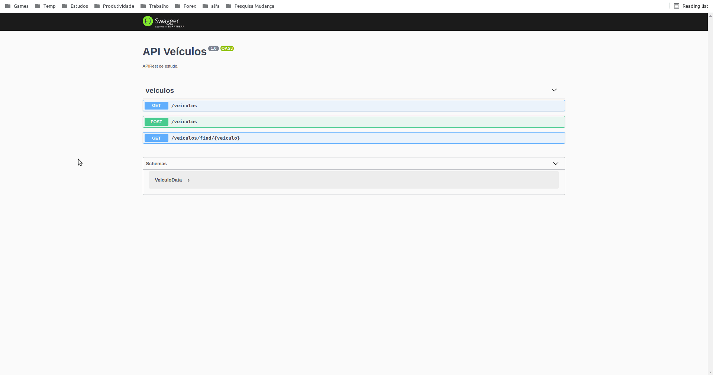

# Teste Fullstack

Este projeto envolve o consumo da API **veículos** criada conforme orientação (backend e frontend)

## Screenshots

### Browser Perspectiva:
gif do projeto rodando



## Bibliotecas utilizadas 

### Fullstack
- eslint - Padronização de código

### Backend
- typescript - Superset Javascript
- swagger - Exposição e documentação da API
- nest - Framework backend
- mongodb - Conector ao banco MongoDB

### Frontend
- react - Base Frontend
- styled-components - Componentes CSS com javascript
- axios - Usada para acessar as APIs.
- react-router-dom - Gerenciar Rotas e navegação em nossa aplicação.
- react-icons - obter opções de icons.
- toast - tratamento de excessões e dados
- prop-types - validação de props
- react-loadingg - Loading durante processamentos
- history - Histórico de navegação (browser)
- validator - tratamento de excessões

# Rodando o projeto
Projeto desenvolvido em node 10.24.1, recomendado rodar na mesma versão.

## Backend - Instalando e rodando a API
Acesse o diretório /backend e execute os comandos:

Instalar com 
```
 npm install
```

Depois executar com
```
 npm run start:dev
```

Caso queira, endereço do swagger: [API Swagger](http://localhost:8085/api/)

Após o back estiver rodando, iniciar o front conforme abaixo.

## Frontend - Instalando e rodando o front

Acesse o diretório /frontend e execute os comandos:

Instalar com 
```
 npm install
```

Depois
```
 npm run start
```

- URL do front: [FrontEnd](http://localhost:3000/)

## Construído com

- [ReactJS](https://pt-br.reactjs.org/) - Biblioteca Front-end.
- [Swagger](https://swagger.io/) - Rotas e documentação API
- [NestJS](https://nestjs.com/) - Framework Backend

## Autor

- **Osvaldo Costa** - [rimancete](https://github.com/rimancete)

## Melhorias propostas
Funcionalidades
- Segurança: Implementar sistema de autenticação
- Edição de veículos
- Tratativa de excessões

Layout
- Responsividade
